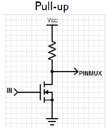

# Project 2: LED on/off

The purpose of this report is to describe how the code is implemented, to highlight key points of the code, and to present the results. The goal of the work is to create a routine that will measure how quickly a person can press a switch in response to an LED that turns on or off.

## Implementation

Initially, it was used the **STM32F401RE microcontroller (ARM Cortex-M4)** and the tools of **Keil**, CMSIS Core and Device Startup were used. The code was written in C and uses the drivers (platform.h, gpio.c, gpio.h) that have been given to us, it is noted that the drivers are in a different folder whose path was included in the specific project. Additionally in the same folder as main.c are the files delay.c, delay.h, leds.c, leds.h and cycle_ccnt.h, which are used in main. A detailed reference to these files is given below. Moreover **ARM Compiler 5 and ST-Link Debugger** were used. Finally, reference should be made to the public variable flag, which is declared as volatile, to inform the compiler that in addition to the main is also used by the Interrupt Handler.

> #### delay.c & delay.h

These files implement functions that can be create a delay at some point in the code.

> #### leds.c & leds.h

These files contain the function that initializes a led and the function that can flash it. In this implementation the only available led of the board is used. This led is written on the board named LD2 and the pin to which it is assigned is PA_5. In platform.h this pin is set to P_LED_R.

> #### cycle_ccnt.h

It is a control library of DWT (Data Watchpoint and Trace) registers. Its purpose is to measure machine cycles for a specific execution block of the code. First the register names are mapped to addresses, and then the basic functions are defined. Specifically, functions are defined for initialization, reset, activation, deactivation and reading of the circular Counter.

> #### void button_press_isr(int sources)

This is a routine written to the main file and used as an Interrupt Handler when the USER button on the board is pressed. So if this button is pressed, the value of a volatile public variable changes to 0.

> #### main.c

The main routine initializes the LED as Output using the leds_init () method. It then uses the gpio_set_mode method of the gpio.h library to set the switch P_SW pin on the board as the Pullup input and gpio_set_trigger to set it to Rising (positive edge). This way the signal will be received when the user releases the button. An attempt was made to implement the program with the Falling method, so that the signal is received when the button is pressed, however it was not possible, we assume due to the given drivers. Finally, the gpio_set_callback function (P_SW, button_press_isr) is called, to connect the press of the button with the dial of the Interrupt Handler that was written, while the interrupts are activated with the __enable_irq () method. Next is the while (1) loop, in which the basic functions of the program are performed.

    

At this point, the value of the flag variable is set to 1. Then the leds_set (! ExpType) routine is called, which for type 1 experiment turns off the LED, while for type 0 experiment it turns it on. This function depends on the expType variable, which is defined at the beginning of the program. A simulated delay (3-8 seconds) is created, using a rand as an argument in the delay_ms routine. After this time the leds_set (expType) is called, so that the LED turns off or on accordingly. Using the methods of the cycle_ccnt.h library, the counter that counts machine cycles is initialized, reset and activated. At this point the main "waits" for an interrupt using a while (flag) command. Thus, this loop will be completed as soon as the value of the flag variable is changed externally by the Interrupt Handler. Immediately the counter value will be taken and will be deactivated.

The next step is to calculate the time based on the number of machine cycles that have passed. This will be done by dividing by the system clock (SystemCoreClock = 16000000) and multiplying by 1000, so that the calculation is done in milliseconds. The result will be inserted in the appropriate position of a table, the index of which will increase for the next experiment. Once the table of 5 places is completed, its average value will be calculated.

## Testing

A breakpoint was set to get the results so that the avgTime value is displayed each time it is calculated. For each case 6 experiments were performed. The results for the average time in ms (milliseconds) are shown below:

|   Experiments   |   1   |   2   |   3   |   4   |   5   |   6   |
| :-------------: | :---: | :---: | :---: | :---: | :---: | :---: |
| **expType = 1** | 374.3 | 333.9 | 385.4 | 352.6 | 401.1 | 402.8 |
| **expType = 0** | 316.3 | 385.9 | 298.6 | 319.1 | 260.2 | 332.8 |

expType = 1: Response to an LED that lights up.

expType = 2: Response to an LED that goes off.